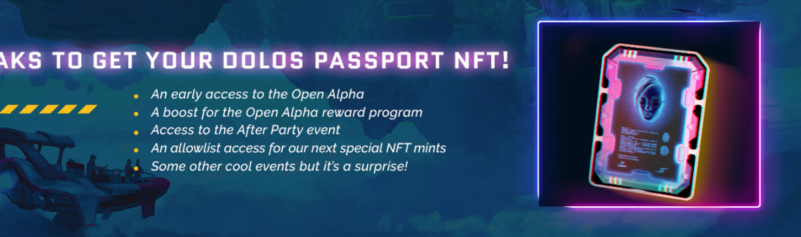

# Life Beyond Origin Collection

Life Beyond Origin Collection NFT - 常见问题（FAQ）
▶ 什么是 Life Beyond Origin Collection？
Life Beyond Origin Collection 是一个NFT（Non-fungible token）集合存储。在区块链上的数字收藏品集合。
▶ Life Beyond Origin Collection 代币有多少？
Life BeyondOrigin Collection NFT。目前767，767位车主的钱包中至少有一个Origin Collection。
▶ 最昂贵的 Life Beyond Origin Collection 销售是什么？
出卖最贵的 Life Beyond Origin Collection NFT 是 Apartment Access Key BAYC-AAK-BAYC。它售于 2022 年 6 月 7 日（3 个月前）以 181.4 美元的价格出售。
▶最近最重要？多少生命超越了本系列
一个过去 30 共售出 7 个 Origin 1,0 Life Beyond Collection NFT。
▶ Life Beyond Origin Collection 需要多少？
在过去的生活中 Origin Collection NFT 最便宜的 Beyond 使用 3 美元，最多使用 24 美元。 Beyond Life Collection NFT 在过去 30 的中位价格为 5 美元。

