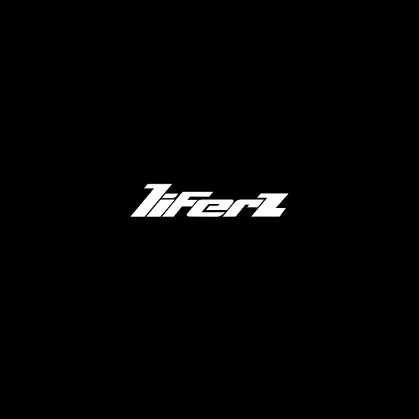

# The Liferz

2,500 张实验室门票。© 通过时尚和收藏品将 NFT 文化与现实世界联系起来。Liferz NFT - 常见问题（FAQ）
▶ 什么是 The Liferz？我们还有更多实验室门票，欢迎前来。
Liferz 是 NFT（非同质代币）集合。存储在一条链上的数字收藏品集合。
▶ 有多少 The Liferz 代币？
一个生命号车有514个。目前，150个主的钱包中至少有一个生命号。
▶ The Liferz最近最近了多少？
过去 30 个人共售出 0 个 NFT。过去 7 天没有售出 The Liferz。

