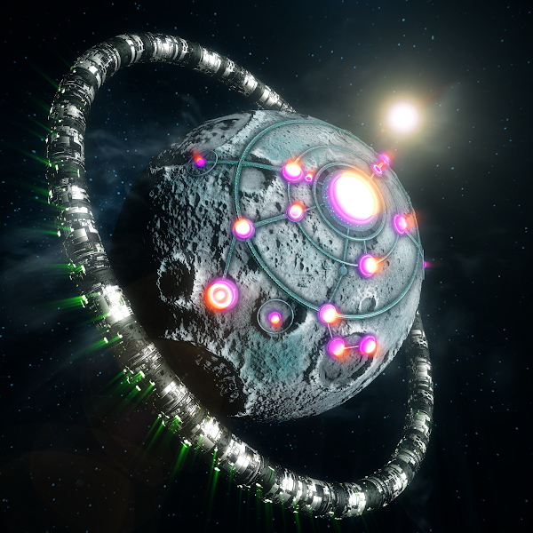

# Lifestory Planets

Lifestory Planets Collection (The Lifeverse) 包含 5555 颗作为 NFT 出售的行星。这些星球将允许个人和品牌以几乎无限的方式创建自己的私人元宇宙。每个星球都是可定制的，并允许所有者出租或出售他们的包裹。Lifestory Planets NFT - 常见问题（FAQ）
▶ 什么是 Lifestory Planets？
Lifestory Planets 是一个 NFT（不可替代代币）集合。存储在区块链上的数字收藏品收藏。
▶ 存在多少 Lifestory Planets 代币？
NT有826个Lifestory Planets NFT目前，281个有生命故事的行星星球。
▶ Lifestory Planets 最贵的促销活动是什么？
最贵的 Lifestory Planets NFT 是 Hidden Planet。它于 2022-06-09（3 个月前）以 721.9 美元的价格售出。
▶行星生命？多少生命故事
过去 30 个 Lifestory 提供 27 个 Planets NFT。
▶ Lifestory Planets 的价格是多少？
在过去的 NFT 天里 0 天里星球的 220 美元最便宜的交易价格，最高超过 460 美元。Lifestory Planets N 3 的中位在过去 30 天，FT 为 366 美元。

