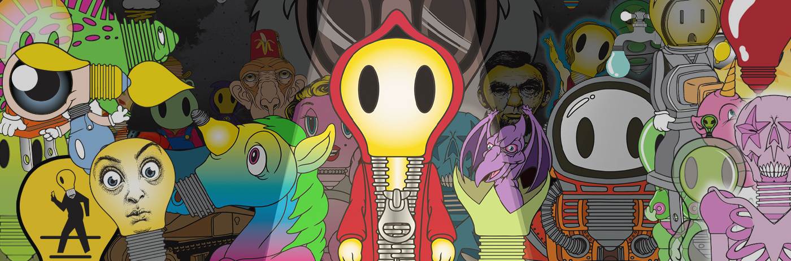

# Light Cult Crypto Club

Ron English 选择了元宇宙。这位纽约当代艺术家和多产的文化干扰者设计了一系列 NFT，将他在过去 40 年职业生涯中最伟大的艺术理念提炼成该理念的通用符号 - 灯泡。欢迎来到来自 Ron 本人大脑的 10,008 种光崇拜。
Light Cult Crypto Club NFT - 常见问题（FAQ）
▶ 什么是 Light Cult Crypto 俱乐部？
Light Cult Crypto Club 是一个 NFT（非同质代币）集合。存储在区块链上的数字收藏品集合。
▶ 存在多少 Light Cult Crypto Club 代币？
Club有5个8,11个Light CFT。目前，一个Club有42个Club N的加密货币中至少有一个。
▶ Light Cult Crypto Club 最昂贵的交易是什么？
出售的最昂贵的 Light Cult Crypto Club NFT 是。它于 2022-06-18（2 个月前）以 1.6k 美元的价格售出。
▶最近极端了多少 Light Cult？
116 个 Cult Crypto Club NFT 过去 30 个经典售卖。
▶ Light Cult Crypto 俱乐部的费用是多少？
在过去的 30 段 2 5 美元，Club 最便宜的 33 美元的 Light Cult 价格，超过 30 段，超过 Light Crypto 俱乐部 NFT 的 2 中 4 6 美元。

