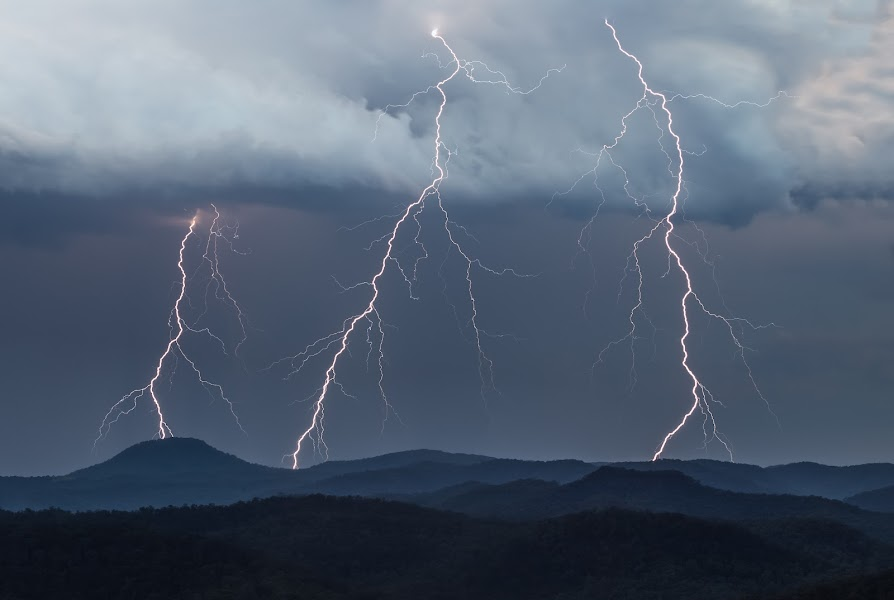

# Lightning Strikes Thrice

限量版 34。当一场严重的雷暴掠过 Watagan 山脉时，雷击三次。黄昏时分，从一个偏远的山脊上拍摄，俯瞰沃伦比山谷和瓦塔根山脉。

最高点是海拔 641 米（2,103 英尺）的 Warrawolong 山，在这张照片中直接被闪电击中。由于在温暖的夏季月份太阳提供的能量增加，加上有利于风暴增长的天气模式，严重的风暴季节风暴增加。

瓦塔根山脉或瓦塔根山脉是位于澳大利亚新南威尔士州亨特地区的大分水岭一部分的山地荒野地区。

