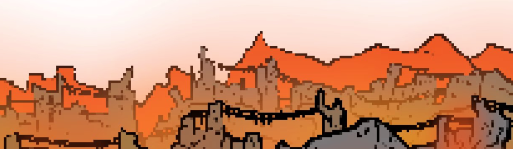

# lilgoblins.wtf

怎么回事？一个 Lil Goblin 和两个 Poops，每小时，forever.lilgoblins.wtf
Lil Goblins DAO 是具有 goblinish 拍卖机制的 cc0 收集器 DAO

Lil Goblins DAO 是基于 Nouns DAO 的扩展 DAO，致力于在 Nouns 生态系统中创建一个新层；地精 CC0 收藏家。通过扩展生态系统，Lil Goblins DAO 旨在让更多人接触到名词。

在下面了解更多信息，或开始使用 Playground 链下创建 Lil Goblins。操场是使用名词协议的一个分支构建的。 Lil Goblin 的特征由名词种子决定。种子是使用 lilgoblins-assets 生成的，并使用名词-sdk 渲染。

