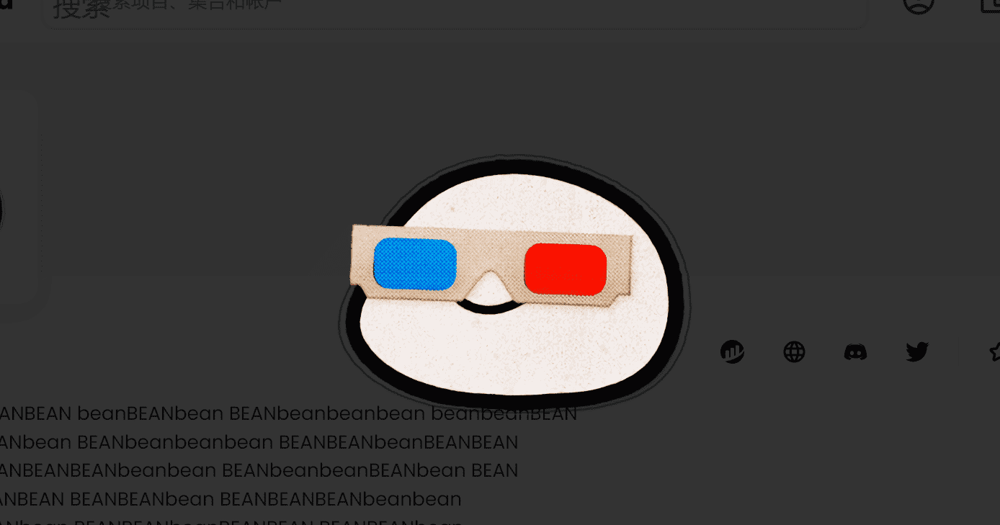

# LILBEAN

LILBEAN 是一个 NFT（不可替代代币）集合。存储在区块链上的数字艺术品集合。总共有 3,333 个 LILBEAN NFT。目前，2,431 位所有者的钱包中至少有一个 LILBEAN NTF。在过去 30 天里，最便宜的 LILBEAN NFT 销售额低于 8 美元，最高销售额超过 45 美元。LILBEAN NFT 在过去 30 天内的中位价格为 36 美元。

