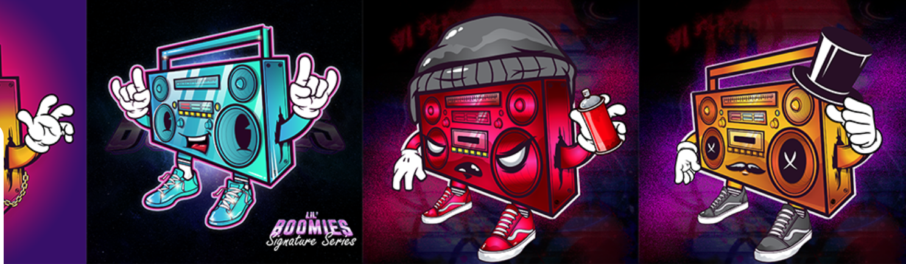

# Lil' Boomies

Lil' Boomies 是第一个融合资产和音频所有权的嘻哈灵感 NFT。由 Young LORD 制作，他的作品包括 Nicki Minaj、Cassidy、Canibus、各种电视节目和视频游戏。在你的钱包里放一个 Lil' Boomie 并发出一些声音！Lil' Boomies NFT - 问题常见（FAQ）
▶ 什么是 Lil' Boomies？
Lil' Boomies 是一个 NFT（非同质代币）集合。存储在区块链上的数字收藏品集合。
▶ 有多少 Lil' Boomies 代币？
Lil'l 2位车893'NFT。目前，3个主的钱包中至少有一个Boomies
▶最近多大了？
Boomies NFT 过去 30 件出售 0 个。

