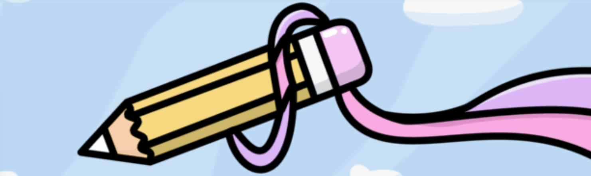

# Doodled Punks Babies

\#质押：

🥩 把你的涂鸦朋克[放在这里](https://punksdoodled.com/)🥩

🚨 截至 2022年 6 月 7 日，已抵押**22%** (554/2,500) 🚨

＃关于：

2,500 个手绘朋克式人类化身，采用赏心悦目的色彩设计.. 🌈✏️

每个涂鸦朋克都是由 125 个手绘特征以编程方式生成的。

持有者将能够在不久的将来认领他们的雌性伴侣并使用我们的定制育种机制。

\#Verified 智能合约： [NFT](https://etherscan.io/address/0xf21d1b31b15282592ff0e48f7b474b57ae418361#code) · [Staking](https://etherscan.io/address/0x55ddc9cac7afd54223caefe79d0fb36af6ecb4d0#code) · [Utility Coin](https://etherscan.io/address/0x00e595d4060dcf65c9c5622aa02d6b999f7835db#code)

\#我们不隶属于任何其他项目

当你的 Doodled Punk NFT 被质押在智能合约中时，它们可能会积累一个实用代币（“$DUNKS”）。$DUNKS 除了在 DUNK 生态系统内没有其他功能，并且不能从开发者处购买。

