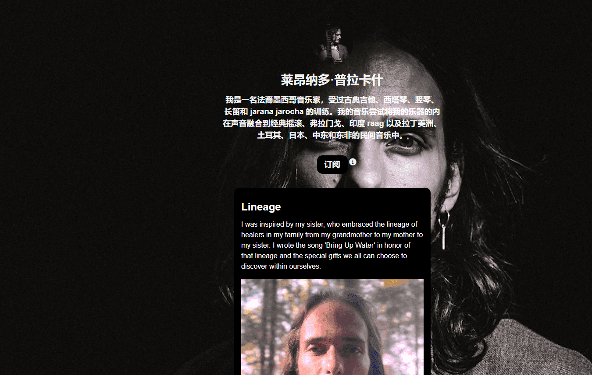

# Lineage V2

我是一名法裔墨西哥音乐家，受过古典吉他、西塔琴、竖琴、长笛和 jarana jarocha 的训练。我的音乐尝试将我的乐器的内在声音融合到经典摇滚、弗拉门戈、印度 raag 以及拉丁美洲、土耳其、日本、中东和东非的民间音乐中。

就像春天午后的第一滴雨水，一把尼龙弦吉他在“带来水”中营造出郁郁葱葱的音乐景观，这是一首旨在激发幸福和希望的原声民歌。Leonardo Prakash 的歌词让人联想到 60 年代和 70 年代最伟大的民谣唱片

