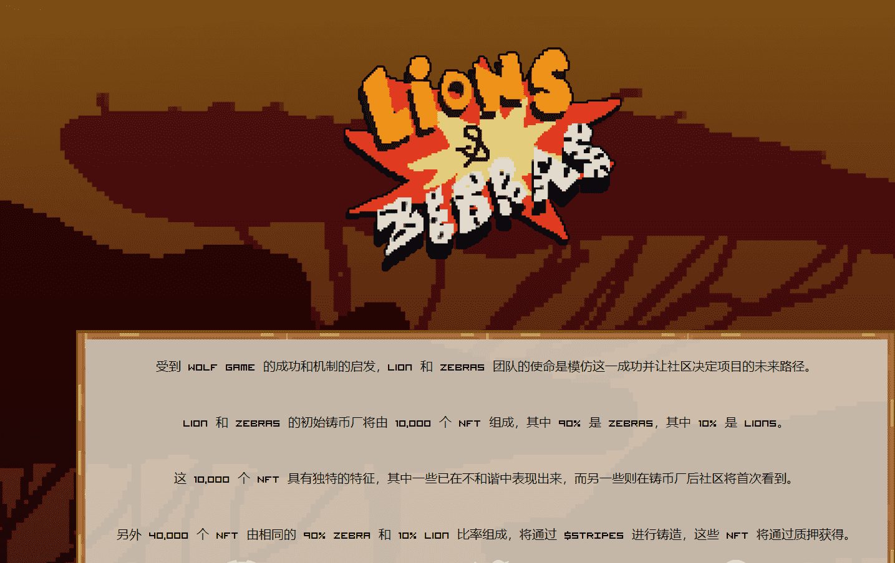

# Lion and Zebra

成千上万的狮子和斑马为STRIPES 的奖品进行比赛，谁会赢？

真实的拥有者数量比 Opensea 上显示的要高，这是因为大量的狮子和斑马被赌注。

受到 Wolf Game 的成功和机制的启发，Lion 和 Zebras 团队的使命是模仿这一成功并让社区决定项目的未来路径。

Lion 和 Zebras 的初始铸币厂将由 10,000 个 NFT 组成，其中 90% 是 Zebras，其中 10% 是 Lions。

这 10,000 个 NFT 具有独特的特征，其中一些已在不和谐中表现出来，而另一些则在铸币厂后社区将首次看到。

另外 40,000 个 NFT 由相同的 90% Zebra 和 10% Lion 比率组成，将通过 $STRIPES 进行铸造，这些 NFT 将通过质押获得。

