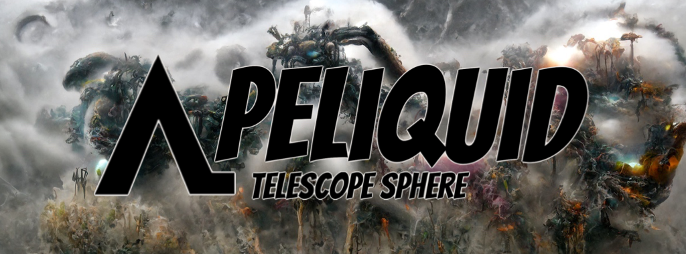

# Liquid Keys

**液体键**

*more_horiz*

来自[ApeLiquid.io]的 Liquid Keys 可解锁 Liquid Forge 和 Evolution Chamber，持有者可以通过牺牲 Liquid Legend、Liquid Invader 或 Azuki Ape Social Club 并燃烧液体神器来激活 Evolution Chamber，从而进化出神话生物。

液态金属：METL代币

Liquid METL 是一种完全抵押的 ERC-20 代币。使用 Metamask 或 Uniswap & 快速轻松地转换为 ETH 或从 ETH 转换。

金属锻造：锻造液体METL

每月赚取所有 Forged METL 的 1%。

猿液：会员卡
Private Discord
METL Rewards
Liquid Keys Dropped
10 METL Monthly (each)
Azuki Ape Royalties
Future Utility

液体键：仅限会员掉落

液体钥匙解锁液体锻造和即将到来的进化室。

钥匙有一个**世界**&**增强**&**稀有** &**进化**。

