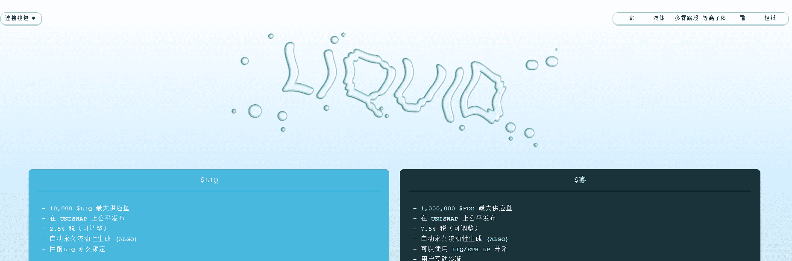

# Liquid Cards

流动性重叠理论是，我们可以将底层代币作为核心价值主张来创造经济，以激励这个实用生态系统中的活动。

Liquid ($LIQ) 代币构成了流动经济系统的中心。LIQUID 的“门限证明”形式被称为“ALGO”——自动流动性生成操作。

它的区别有两个方面：目前，更高的税率（每笔交易 2.5%）以及将 LP 代币锁定在合约内而无法移除它们的运动。当交易时自动生成的 LP 代币实现时，它们会自动发送到合约中，因此任何转移或移除功能都无法再次触及它们。

流动性永久上升，价格下限永久上升。

