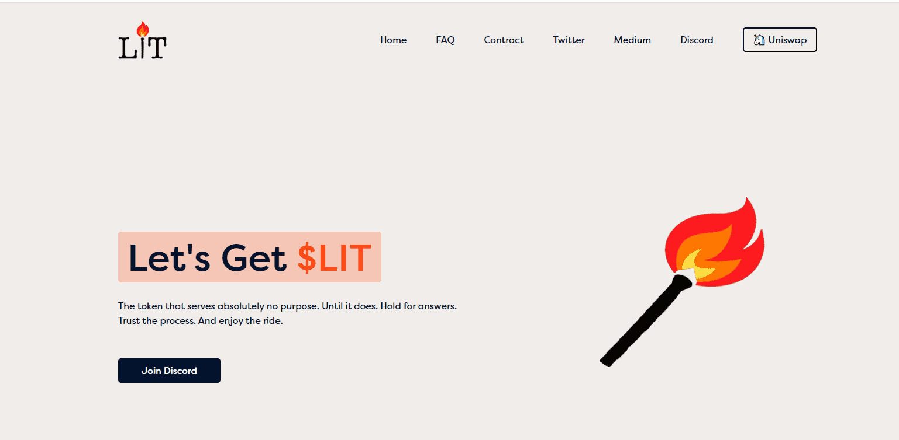

# LIT Project One

$LIT 与 10 倍《纽约时报》畅销书作家 Neil Strauss 合作，为持有者提供一系列独家体验中的第一名。Survive All Apocalypses 是第一本用于以太坊区块链的主要去中心化书籍。您可以通过在移动设备上点击翻页或在桌面上点击直接从您的 OpenSea 帐户阅读本书。使用由 Transient Labs 开发的开创性智能合约，NFT “书籍”不再只是允许您解锁或下载内容的通行证。这本历史书可以直接在 NFT 市场上阅读。

这些 NFT 之一将通过 Chainlink VRF 随机选择，相应书籍将更新版权。当读者是出版商时会发生什么？

注意，为了保护 NFT 账簿的其他持有者，以及其他有待披露的原因，将保留某些权利。

