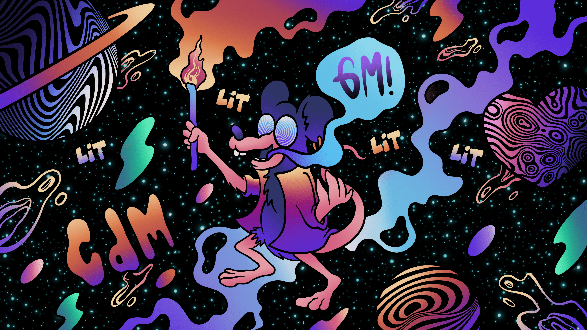

# LITizen 1: GM

受到#HouseofMedici 的@CozomoMedici 领导的“GM”文化和@rata_yonqui 对LITizen 文化的独特注入的启发，“LITizen I: GM”系列诞生了，标志着该系列成为LIT 之外的第一个感恩姿态LITizen 对 LITizens 的行政管理，以庆祝 LIT 文化。

该系列的名称中留下了连续性的暗示。这个系列是一场运动的开始，它将展现我们最狂野的想象力。

我们将共同为文化、艺术和娱乐的未来铺平道路。

▶ 什么是 LTizen 1：GM（官方）？
LITizen 1：GM（官方）是一个 NFT（非同质代币）集合。存储在区块链上的数字艺术品集合。
▶ LTizen 1: GM（官方）代币有多少？
总共有 3 个 LTizen 1：GM（官方）NFT。目前，812 位所有者的钱包中至少有一个 LITizen 1: GM（官方）NTF。
▶ 最昂贵的 LTizen 1: GM（官方）销售是什么？
最昂贵的 LTizen 1: GM (Official) NFT 是 GM 2。它于 2022-06-18（2 个月前）以 13.2 美元的价格售出。

