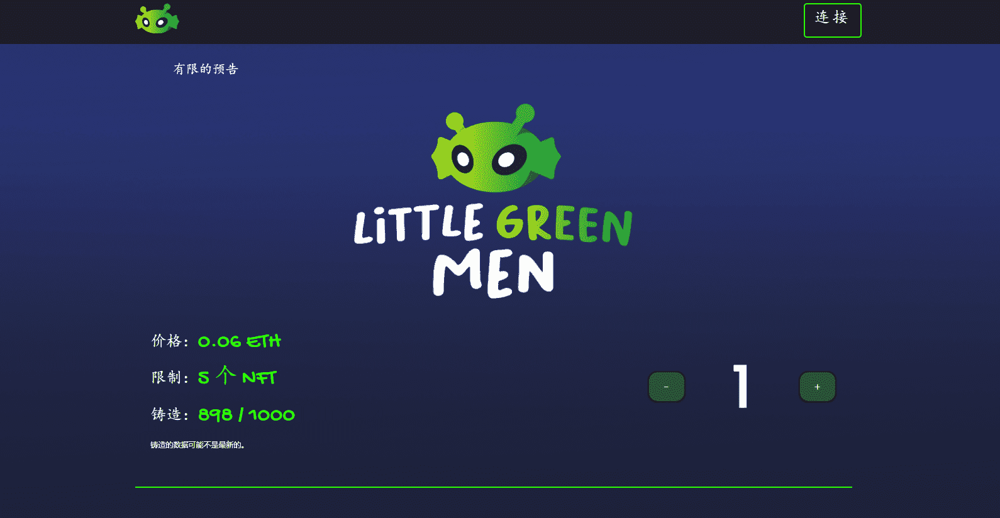

# Little Green Mene

Little Green Men 是一个衍生的 NFT 集合，包含 9,999 个稀有 Nft，以社区为重点。 

每个 NFT 都是使用 140 多种属性（如帽子、眼睛、皮肤等等）的组合通过算法生成的！

 Little Green Men 在以太坊 (ETH) 区块链上推出，旨在以可承受的价格提供高质量的艺术品，同时执行广泛的路线图。

Little Green Men 是以太坊区块链上 10,000 个独特外星人的集合。LGM 是一个社区驱动的项目，旨在通过国际活动和慈善活动来促进太空探索。我们的目标是在世界上留下持久的遗产。我们想做一些独特的、协作的和光荣的。谁知道呢，说不定有一天我们会在火星上举办会员专享派对！你准备好加入我们的太空冒险之旅了吗？

