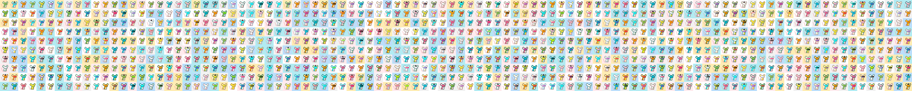

# Little Mouse (polygon)

过去 7 天内没有售出小老鼠（多边形）。

1000 只小老鼠跨越锁链生活 | Layerzero 全链 nft

小老鼠（多边形）NFT - 常见问题（FAQ）
▶ 什么是小老鼠（多边形）？
Little Mouse (polygon) 是一个 NFT (Non-fungible token) 集合。存储在区块链上的数字艺术品集合。
▶ 有多少个小老鼠（多边形）代币？
总共有 136 个小老鼠（多边形）NFT。目前，71 位所有者的钱包中至少有一个小老鼠（多边形）NTF。
▶ 最近卖出了多少只小老鼠（多边形）？
过去 30 天内售出 0 个小老鼠（多边形）NFT。
▶ 什么是流行的小老鼠（多边形）替代品？
许多拥有 Little Mouse（多边形）NFT 的用户还拥有 PepeTrumps、 OmniMonke（poly）、 ZombieToadz和 Layer Zero Punks | 多边形。

