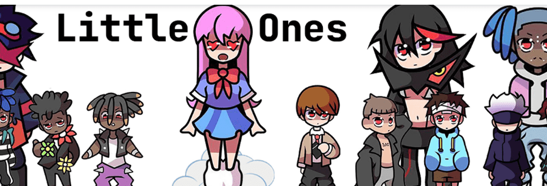

# Little Ones NFT

调入您的角色，感受他们的代表并将他们带入生活！ 3333 个独特的手工制作的角色为他们的收藏家带来了生命。

过去 7 天内没有售出 Little Ones NFT。

Little Ones NFT NFT - 常见问题（FAQ）
▶ 什么是 Little Ones NFT？
Little Ones NFT 是一个 NFT（不可替代代币）集合。存储在区块链上的数字艺术品集合。
▶ Little Ones NFT 代币有多少？
总共有 3,333 个 Little Ones NFT NFT。目前，2,156 位所有者的钱包中至少有一个 Little Ones NFT NTF。
▶ 最昂贵的 Little Ones NFT 销售是什么？
卖得最贵的 Little Ones NFT NFT 是 Little Ones #612。它于 2022-06-09（3 个月前）以 59.2 美元的价格售出。
▶ 最近卖出了多少 Little Ones NFT？
过去 30 天内售出了 42 个 Little Ones NFT NFT。
▶ Little Ones NFT 需要多少钱？
在过去 30 天里，最便宜的 Little Ones NFT NFT 销售额低于 2 美元，最高销售额超过 50 美元。Little Ones NFT NFT 的中位价格在过去 30 天内为 17 美元。
▶ 有哪些流行的 Little Ones NFT 替代品？
许多拥有 Little Ones NFT NFT 的用户还拥有 My Little Pug、 BrawlerZ Kingdom、 MakeShitHappen和 GoblinWaifus V2。

