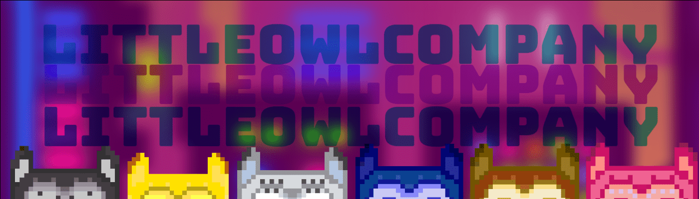

# locnftmetro-pre

🌎 生成您独特的小猫头鹰不仅可以获取会员福利和奖池，还可以保护加拿大受伤和孤儿的猫头鹰。🦉 小猫头鹰公司首次推出他们的第一个项目 Metrop{owl} 是：1200 只独特的小猫头鹰 NFT 从他们的城市被绑架到 Polygon 区块链中。 Little Owls 存储在 Polygon Matic 区块链的 ERC-721 合约中。 每件作品都是手工制作的，小猫头鹰由一个编码应用程序组合在一起。 为所有复古和 8Bit 粉丝、夜班工作者、晚睡者，当然还有失眠者而制作。

Little Owl Company NFT - 常见问题（FAQ）
▶ 什么是小猫头鹰公司？
Little Owl Company 是一个 NFT（非同质代币）集合。存储在区块链上的数字艺术品集合。
▶ Little Owl Company 代币有多少？
总共有 1,200 个 Little Owl Company NFT。目前，37 位所有者的钱包中至少有一个 Little Owl Company NTF。
▶ 最近卖出了多少家小猫头鹰公司？
过去 30 天内售出 0 个 Little Owl Company NFT。

