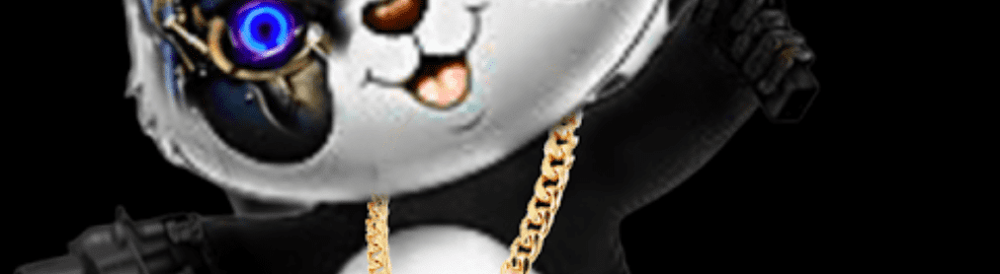

# Little Panda V2

Little Panda Tremax 是作为 NFT 的 Little Pandas 的第一个 3D 动画数字艺术收藏。 Little Panda 3D 由在多边形区块链上铸造的 1,000 个有限的独特 3D 字符组成，因此减少了汽油费和碳排放。 每个 NFT 都包含一个可解锁的资产包，可让您的 Little Pandas 访问元宇宙 (Pandaverse)、增强现实、虚拟现实以及几乎任何 3D 建模或动画软件。 如果您拥有 Little Panda NFT，您就是 Little Panda COLLECTORS CLUB 的一员。 访问独家空投、私人活动、VIP Discord 身份和身临其境的社区。

小熊猫 Tremax NFT - 常见问题（FAQ）
▶ 什么是小熊猫 Tremax？
Little Panda Tremax 是一个 NFT（非同质代币）集合。存储在区块链上的数字艺术品集合。
▶ 有多少个 Little Panda Tremax 代币？
总共有 1,000 个 Little Panda Tremax NFT。目前，27 位车主的钱包中至少有一个 Little Panda Tremax NTF。
▶ 最近卖出了多少只小熊猫 Tremax？
过去 30 天内售出 0 个 Little Panda Tremax NFT。

