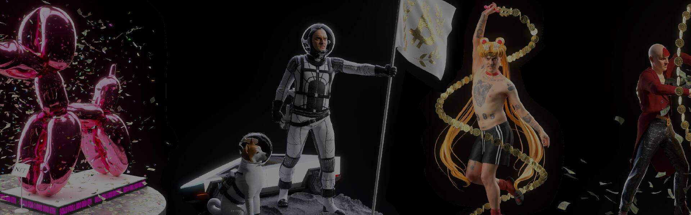

# LittleBigYAITSO

来自 Little Big Band 的 CCKY drop 的限量版 NFT。 仅在 Polygon 网络上铸造。 2021. CCKY - 作为 Crypto Cyber Kinder Yaitso，更多信息。Eggs 已于 2021 年 12 月 11 日孵化。完整系列：Eggs Figurine Cryptomatadors

LittleBigYAITSO NFT 在过去 7 天内售出 1 次。LittleBigYAITSO 的总销售额为 12.08 美元。一个 LittleBigYAITSO NFT 的平均价格为 12.1 美元。有 558 位 LittleBigYAITSO 所有者，总共拥有 933 个代币。

LittleBigYAITSO NFT - 常见问题（FAQ）
▶ 什么是 LittleBigYAITSO？
LittleBigYAITSO 是一个 NFT（不可替代代币）集合。存储在区块链上的数字艺术品集合。
▶ 存在多少个 LittleBigYAITSO 代币？
总共有 933 个 LittleBigYAITSO NFT。目前，558 位所有者的钱包中至少有一个 LittleBigYAITSO NTF。
▶ 最昂贵的 LittleBigYAITSO 销售是什么？
售出的最昂贵的 LittleBigYAITSO NFT 是 Yaitso。它于 2022-06-15（2 个月前）以 13.3 美元的价格售出。
▶ 最近卖出了多少 LittleBigYAITSO？
过去 30 天内售出了 3 个 LittleBigYAITSO NFT。

