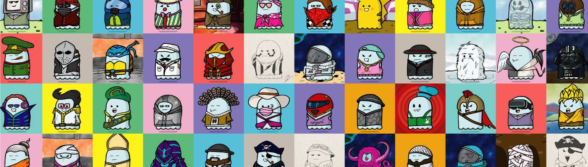

# LittleBoos V2

“LittleBoos”旨在成为儿童图书、独立儿童漫画和儿童电子商务行业中广受认可的创意品牌。作为 LittleBoos 系列的一部分，这些 9999 个 NFT 是社区和参与的基础。 LittleBoos NFT 的每个持有者都将获得许多短期和长期利益，包括潜在的独家俱乐部会员资格以及相关 Booverse 收藏的限量版和其他空投、商品折扣、DAO 级别会员资格等等。

LittleBoos V2 NFT - 常见问题（FAQ）
▶ 什么是 LittleBoos V2？
LittleBoos V2 是一个 NFT（Non-fungible token）集合。存储在区块链上的数字艺术品集合。
▶ 有多少个 LittleBoos V2 代币？
总共有 475 个 LittleBoos V2 NFT。目前，185 位所有者的钱包中至少有一个 LittleBoos V2 NTF。
▶ 最近卖出了多少 LittleBoos V2？
过去 30 天内售出 0 个 LittleBoos V2 NFT。

