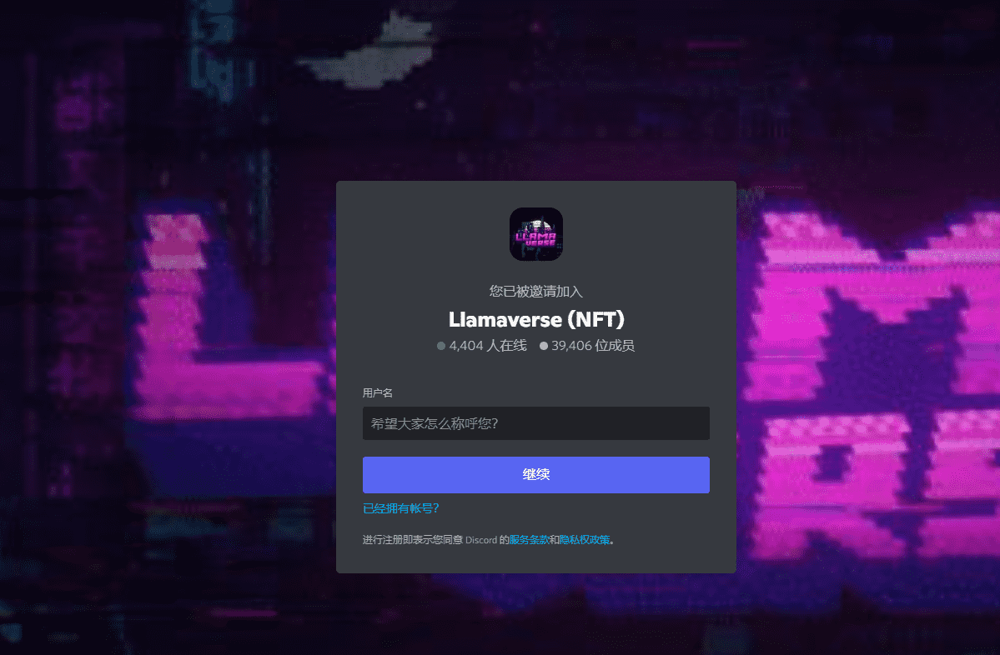

# LlamaPass

可通过 Llama Pass 访问的独家社区。骆驼通行证严格用于奖励持有者。激励措施包括返还给持有人的特许权使用费、独家工具、NFTLlama 的数据驱动电话等等。我们的目标是继续为持有者提供价值，并成为#1 Exclusive Club。

4000 供应 - 3500 银卡 + 500 金卡。

什么是骆驼通行证：？

Llama Pass：是一个 NFT（Non-fungible token）集合。存储在区块链上的数字艺术品集合。

 Llama Pass：代币有多少？

总共有 39 个 Llama Pass：NFT。目前有 2 位车主在钱包中至少拥有一张 Llama Pass：NTF。

Llama Pass：最近卖出了多少？

过去 30 天内售出 0 个 Llama Pass：NFT。

