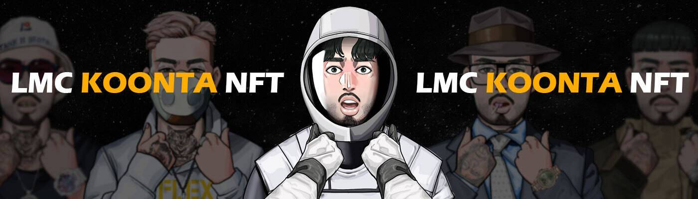

# LMC Koonta

Lion and Musicians Club，“LMC”是一个基于 PFP 的 NFT 项目。 我们尊重嘻哈精神，旨在形成一个真正的 web3 社区，嘻哈艺术家和粉丝聚集在 LMC.Lion 和 Musicians Club 的元界，“LMC”是一个基于 PFP 的 NFT 项目。 我们尊重嘻哈精神，旨在打造一个真正的 web3 社区，嘻哈艺术家和粉丝聚集在以 LMC 为中心的元宇宙中。

LMC KoontaNFT - 常见问题（FAQ）
▶ 什么是LMC Koonta？
LMC Koonta 是一个 NFT（不可替代令牌）集合。存储在区块链上的数字艺术品集合。
▶ 有多少女孩 lmcharmla 代币？
总共有 822 个LMC Koonta NFT。目前，105 位车主的钱包里至少有一个LMC KoontaNTF。
▶ 最近卖了多少LMC Koonta？
过去 30 天内售出 0 个LMC Koonta NFT。

