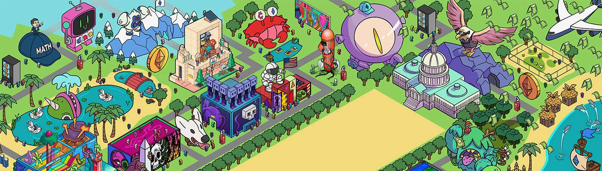

# Lobby3 Membership Token

Lobby3 是一个新的 Web3 社区，旨在让华盛顿特区的人们拥有更强大的声音——这样我们就可以共同建设一个更加繁荣的经济未来。

什么是大厅 3？

Lobby3 是一个新的 Web3 社区，旨在让华盛顿特区的人们拥有更强大的声音——这样我们就可以共同建设一个更加繁荣的经济未来。

Web3 的出现提供了一个历史性的机遇：分散经济机会，消除金融包容性障碍，消除贫困，改善人类状况。

不幸的是，消息不灵通和设计不当的政策可能会阻止 Web3 充分发挥其潜力。

这就是我们建立 Lobby3 的原因——该项目旨在资助有效的政策宣传并教育立法者了解 Web3 的积极潜力。

通过建立 Andrew Yang 和杨帮的独特声音和影响力，Lobby3 将帮助为所有人塑造一个去中心化的经济未来。

