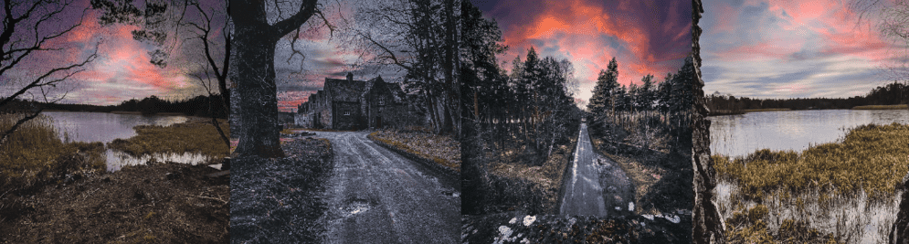

# Loch Of Blairs & The Surroundings

苏格兰布莱尔斯湖的摄影收藏。 我小时候常常把这样的地方视为理所当然，随着年龄的增长，我开始爱上离我住的地方如此近的风景。

过去 7 天没有售出 Loch Of Blairs & The Surroundings。

Loch Of Blairs & The Surroundings从世界各地的著名地标反映了前区块链时代。由人工智能生成的作品，并永久存储在以太坊区块链上，象征着无限货币供应政策对地球的影响。252 件艺术品，每个地点 14 件。

地点：**马丘比丘、喜马拉雅、珠穆朗玛峰、阿尔卑斯山、吉萨、小孩堤防、阿塔卡马、泰姬陵、大本钟、巨石阵、尼斯湖、圣米歇尔山、富士山、卫城、乌鲁鲁、巴塔哥尼亚、新天鹅堡和安第斯山脉。

截至 09/28 未售出的艺术品被退市并从市场上移除。目前仅售8件。

