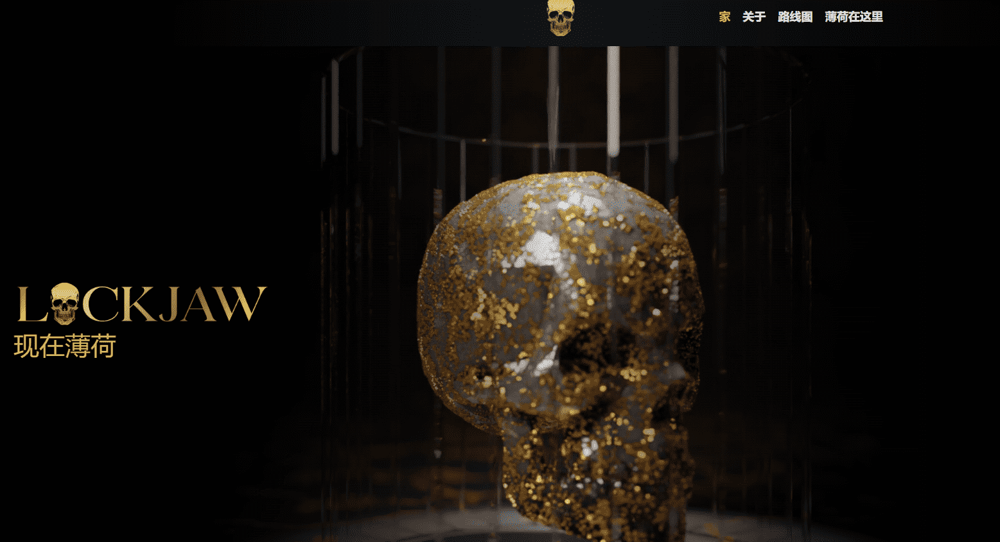

# Lockjaw

Lockjaw 是一系列高分辨率动画 NFT，具有良好的长期效益。Lockjaw NFT 代表了迷人的奢华和邪恶的勇气之间的对比。拥有 Lockjaw NFT 即可获得该头骨的全部商业权利，持有者将能够以 .webm、.mp4、.gif 格式下载他们的 Lockjaw，并将提供所有 Blendr 资产以供随意使用。每天将随机抽取 10 个至少持有 1 个 Lockjaw NFT 的钱包，每个钱包将获得过去 24 小时内产生的 Lockjaw Opensea 版税的 5%。因此，我们每天 50% 的特许权使用费将分配给我们的持有人。

Lockjaw NFT 持有者还将通过集成的 Web3 功能访问我们的后台俱乐部。该俱乐部将作为您进行治理投票、偷窥和直接联系开发人员的一站式目的地。在这里，Lockjaw NFT 持有者将能够决定项目的未来。这些决定将包括潜在的新机制，例如烧伤、现有 Lockjaw NFT 的组合以组合和保持理想特征并增加稀缺性；或调整给予的奖励数量、分配的频率，甚至调整 Opensea 的版税。Lockjaw 计划成为生态系统中最大的基于社区的 NFT 项目，持有者是我们发展中不可或缺的一部分。

