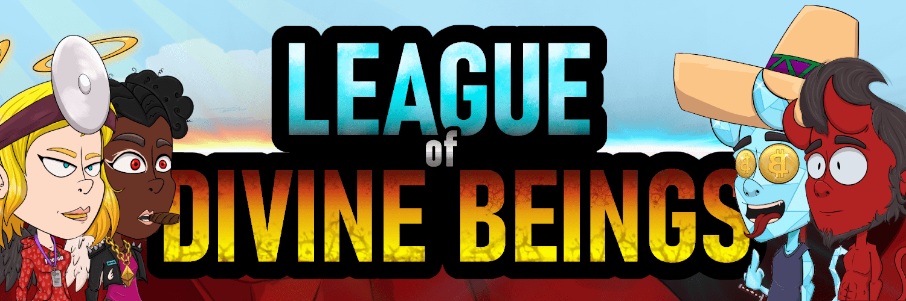

# LODB Angels Collection

The League of Divine Beings 是 P2E 游戏 NFT 的 4 部分系列下降 w/Staking：Devils、Angels、Hybrids 和 Mutants。 每个都有 10k 个独特的 NFT https://discord.gg/divinebeingsnft

经过数千年善恶之间的持续战争，地球上的所有生命都灭亡了。在反思他们行为的后果时，路西法和造物主决定搁置分歧，和平相处。天堂和地狱互相打开了大门。

10,000名男性恶魔和10,000名女性天使被命令转移到地球以修复已经造成的破坏。起初，魔鬼和天使互相提防。但随着时间的推移，他们学会了和谐相处。一个通过生育和 Baphomet 发展起来的混合社区应运而生。

造物主和路西法都认为这是可憎的事，并派出地狱和天堂的军队来摧毁这种罪恶犯罪的产物。他们都派出无与伦比的军队去猎杀混血儿，并将他们的父母赶尽杀绝。善与恶之间又一千年的持续战争成为现实。

随着恶魔与天使的惨败，以及在 Baphomet 下自由的人数越来越少，他们中的一些人在最后的手段之外采取了炼金术的嬗变实践。恶魔与天使开始牺牲他们的孩子，让他们团结起来，一劳永逸地结束苦难。通过他们的 Hybrid Childs 牺牲，他们获得了征服那些控制他们的人并带领他们通过预先确定的道路的力量。让真正的自由意志、幸福与和平最终在地球上茁壮成长，直至永恒。

