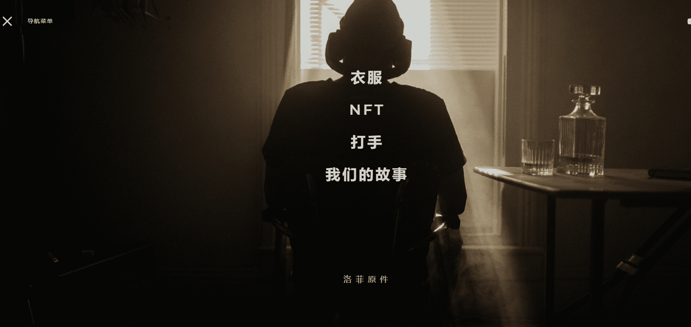

# L.O Community

LO 是 5555 个独特的动画 NFT 的集合，每个都有自己的稀有性，并覆盖了从头开始制作和策划的 LOFI 节拍。LO fam 将在以太坊区块链上振作起来，所以在我们穿越物理和数字世界时加入我们。

 什么是 LO 社区？

LOcommunity 是一个 NFT（不可替代代币）集合。存储在区块链上的数字艺术品集合。

有多少个 LOcommunity 代币？

总共有 6 个 LOcommunity NFT。目前 2 位所有者的钱包中至少有一个 LOcommunity NTF。

最近卖出了多少个LOcommunity？

过去 30 天内售出 0 个 LOcommunity NFT。

