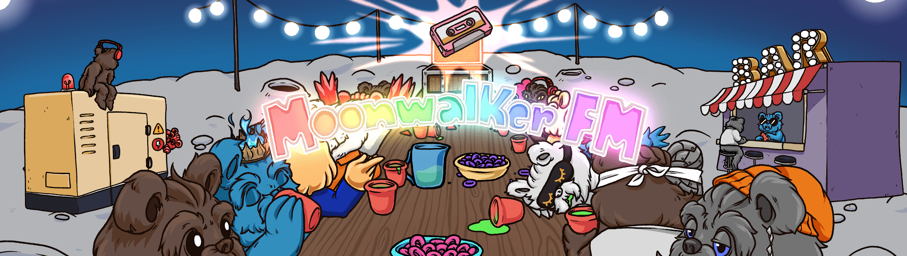

# LoFi Moonwalkers

拥有 Moonwalkers，获得被动奖励，同类首个 NFT 唱片公司！过去 7 天没有售出 MoonwalkerFM。

MoonwalkerFM NFT - 常见问题（FAQ）
▶ 什么是 MoonwalkerFM？
MoonwalkerFM 是一个 NFT（非同质代币）集合。存储在区块链上的数字艺术品集合。
▶ 有多少 MoonwalkerFM 代币？
总共有 581 个 MoonwalkerFM NFT。目前，246 位车主的钱包中至少有一个 MoonwalkerFM NTF。
▶ 最近卖出了多少 MoonwalkerFM？
过去 30 天内共售出 0 个 MoonwalkerFM NFT。
▶ 什么是流行的 MoonwalkerFM 替代品？
许多拥有 MoonwalkerFM NFT 的用户还拥有 RoboCosmic、 Luna Wolves、 Omniya Mint Pass和 Substrata。
 交互式 NFT 项目：Goofball Gang。立即购买。

