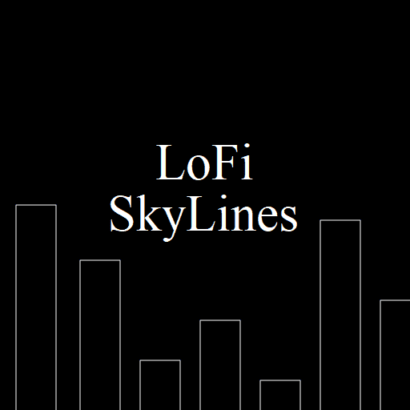

# LoFiSkylines

令牌基础元数据直接存储在合约中，其字段值在每个 tokenURI() 合约调用中生成。它包含名称、图像、animation_url。名称值是从 token_id 生成的。图像值有一个基础。

什么是 LoFiSkylines？

LoFiSkylines 是一个 NFT（不可替代令牌）集合。存储在区块链上的数字艺术品集合。

有多少个 LoFiSkylines 代币？

总共有 3,333 个 LoFiSkylines NFT。目前，1,279 位车主的钱包中至少有一个 LoFiSkylines NTF。

最近售出了多少 LoFiSkylines？

过去 30 天内售出了 2 个 LoFiSkylines NFT。

