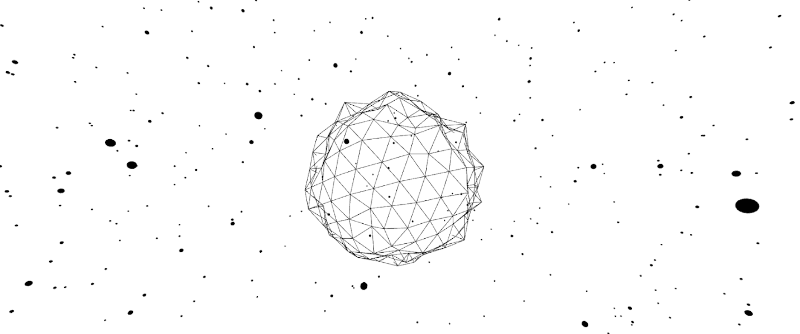

# LoFiStargazer

令牌基础元数据直接存储在合约中，其字段值在每个 tokenURI() 合约调用中生成。 它包含名称、图像、animation_url。 名称值是从 token_id 生成的。 图像值有一个基础，颜色是从令牌种子在链上生成的。 动画颜色和行高是根据令牌种子确定性地实时绘制的。 种子是从 keccak256(minter_address, token_id) 派生的散列，它赋予每个部分独特的、独一无二的外观。 动画代码存储在 IPFS 上并使用种子来驱动动画。 动画生成的代码存储在 IPFS 上，带有 LoFi 节拍，以增强观看体验。 该项目是“LoFiSkylines”的延伸。 1-3333 与它们各自的天际线是 1:1 匹配。 音乐来自 Audius。

