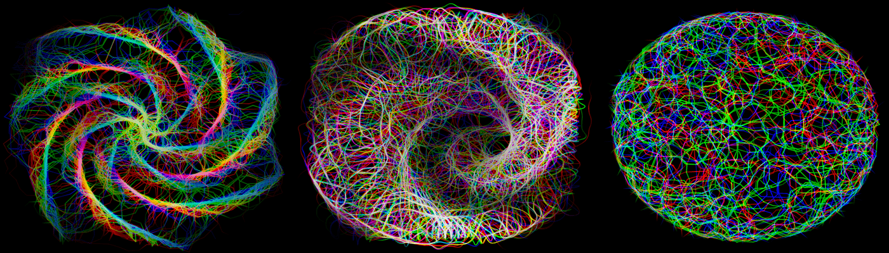

# Logarithms

重要事项在 OpenSea 上购买对数之前，请查看我们的网站 - 所有列表、报价和购买均受 https://logarithms.art 上列出的燃烧时间表的约束。对数增长的活生生的艺术演示。 对数集合是其前身指数的扩展......

对数 NFT - 常见问题 (FAQ)
▶ 什么是对数？
对数是 NFT（不可替代令牌）集合。存储在区块链上的数字艺术品集合。
▶ 有多少个对数代币？
总共有 1,116 个对数 NFT。目前 483 位所有者的钱包中至少有一个对数 NTF。
▶ 最近卖出了多少对数？
过去 30 天内售出 0 个对数 NFT。

