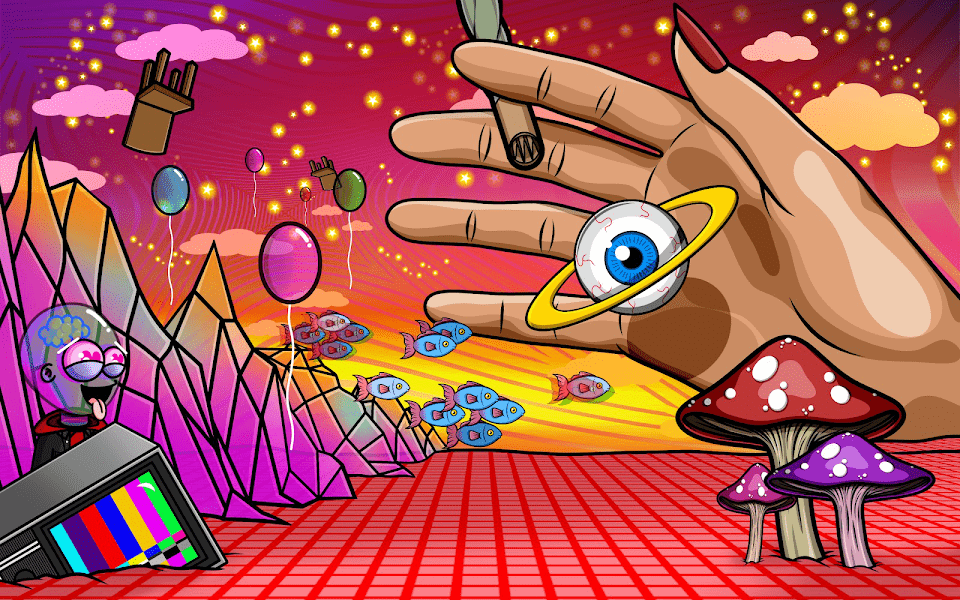

# Lonely Lovers Club

孤独的恋人 | 由艺术家 Brandon Hernandez 用爱手工绘制。 由代码生成并由艺术家策划。我们的目标是传播爱并让尽可能多的人加入 Web 3。您拥有 NFT 的 100% 知识产权，随心所欲地使用它们。这是由 alanthenftguy 创建者赞助的免费铸币厂 加密食人族 NFT。

Lonely Lovers Club NFT - 常见问题（FAQ）
▶ 什么是孤独的恋人俱乐部？
Lonely Lovers Club 是一个 NFT（非同质代币）集合。存储在区块链上的数字艺术品集合。
▶ Lonely Lovers Club 代币有多少？
总共有 5,827 个 Lonely Lovers Club NFT。目前，1,229 位车主的钱包中至少有一个 Lonely Lovers Club NTF。
▶ Lonely Lovers Club 最贵的拍卖会是什么？
最昂贵的 Lonely Lovers Club NFT 是 Hidden Lonely Lover。它于 2022-07-02（大约 2 个月前）以 4.9 美元的价格售出。
▶ Lonely Lovers Club 最近卖出了多少？
过去 30 天内售出了 12 个 Lonely Lovers Club NFT。
▶ Lonely Lovers Club 的费用是多少？
在过去 30 天里，Lonely Lovers Club NFT 最便宜的销售额低于 1 美元，最高销售额超过 4 美元。过去 30 天内，Lonely Lovers Club NFT 的中位价格为 2 美元。
▶ 有哪些流行的 Lonely Lovers Club 替代品？
许多拥有 Lonely Lovers Club NFT 的用户还拥有 Guild A Bear Phase 1、 MAMF Orange、 0xRED和 Crypto Cannibals V2 Official。

