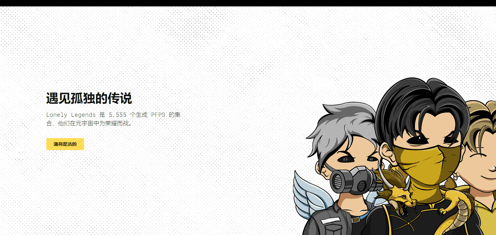

# Lonely Legends Genesis

Lonely Legends 是 5,555 个生成 PFPS 的集合，他们在元宇宙中为荣耀而战。

每个传奇都将成为以漫画风格出版的独特故事的一部分。故事将每周更新，漫画场景将被空投和/或抽奖给持有者。 

Lonely Legends 持有者将能够在 OpenSea 上交易这些漫画场景。收集完整的套装，可能会有一些特殊的 ETH 奖品等着你…… 

漫画的场景将被抽奖，然后每周空投给持有者。你拥有的传奇越多，你赢得一场比赛的机会就越大。如果你用空投的场景完成了一页漫画，可能会有一些特殊的 ETH 奖品等着你！ETH 奖品的范围取决于您收集的场景和页面的数量。奖品将包含大量来自铸币厂和二级销售的 ETH。漫画还将每周在我们的网站上更新，以便您阅读和查看您的传奇故事。

