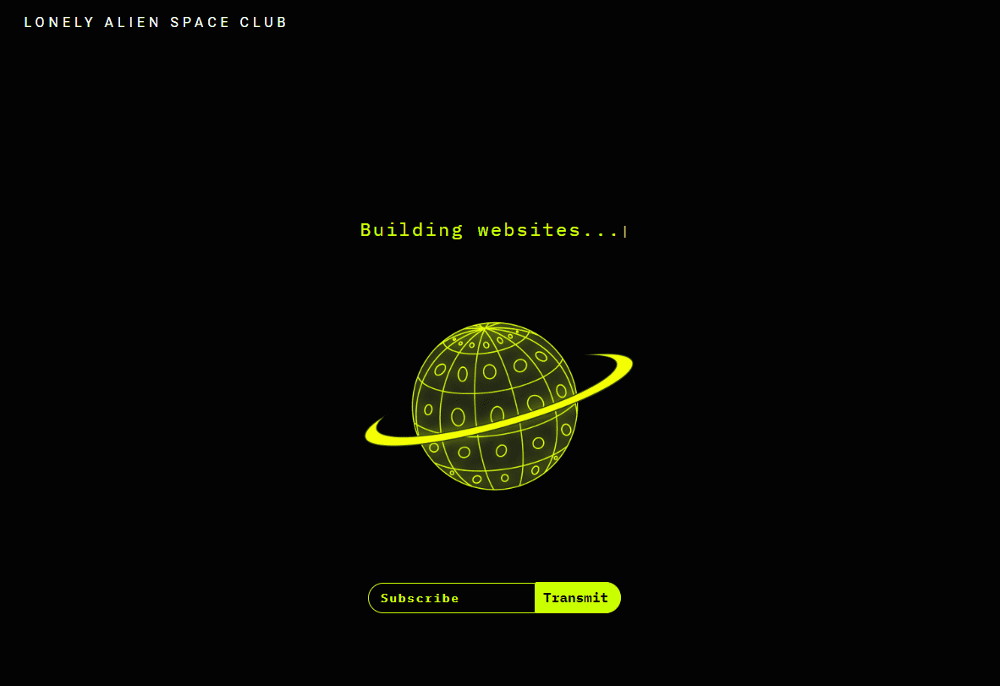

# Lonely Planet Space Observatory

10,001 颗孤独的星球陪伴每一个孤独的外星人。

每个孤独的外星人都将被允许认领他们匹配的#ID Lonely Planet，完全免费+气体。

这是您的新船长讲话。我们已经接管了母舰。我重复一遍，我们已经接管了母舰！！！

孤独的外星人并加入，LASC 社区很强大。很荣幸被任命为 LASC 母舰的一副。我们去哪里，我们就去哪里。查看有关正确使用“化机”的培训材料。完成后，将您的收藏夹放在评论中。

孤独星球太空观测站 铸造你孤独的星球。

