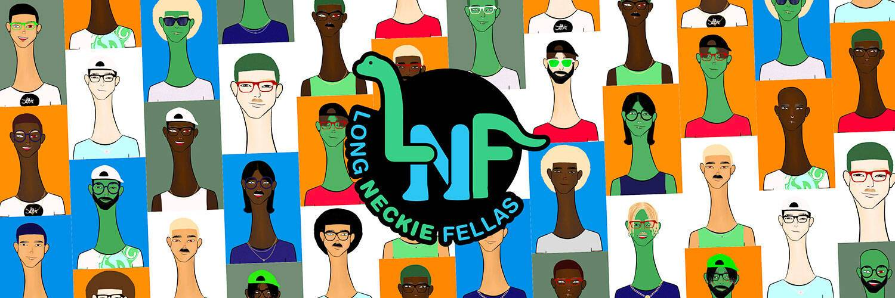

# Long Neckie Fellas

Long Neckie Fellas 是由 12 岁的数字艺术家 Nyla Hayes 创作的 3333 个不同的 Fellas 的手绘、计算机生成的美术收藏品。 每款 Long Neckie 都有一个细长的脖子，灵感来自 Nyla 最喜欢的恐龙雷龙。 Long Neckie 女士 NFT 许可协议* 截至 21 年 8 月 5 日，Long Neckie NFT 收藏家拥有非独家被许可人权利。 请访问 https://nylahayes.com/lnl-licensing-agreement 了解更多详情

Aerial 是一个可持续发展平台，可根据相关能源使用计算碳排放量。补偿将分配给经美国碳登记处验证的高质量森林保护项目以及新兴技术，例如从生物质废物中捕获碳并将其永久储存在地下的 Charm 工业。

