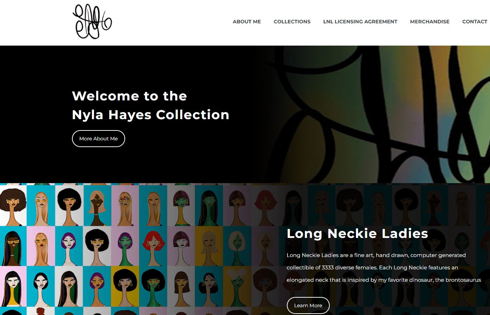

# Long Neckie Ladies

“如果我能做到，你就能做到”

由 13 岁的 Nyla Hayes 创作的梦想家系列。

25+ ETH 用于支持#NFTKIDSART

Long Neckie Ladies 是由 3,333 位多样而优雅的女性组成的精美手绘、计算机生成的收藏品。每款 Long Neckie Lady 都有一个细长的脖子，灵感来自 Nyla 最喜欢的恐龙雷龙。

Nyla Hayes 于 2021 年创造了历史，成为《时代》杂志的第一位 NFT 常驻艺术家，并在 CNN、雅虎财经、Business Insider、Investing.com、Black Enterprise、AfroTech 和其他媒体上出现。奖项包括 NFT.NYC 2021 年度新锐艺术家、Future 50 2021 年最具影响力的科技人物等。

