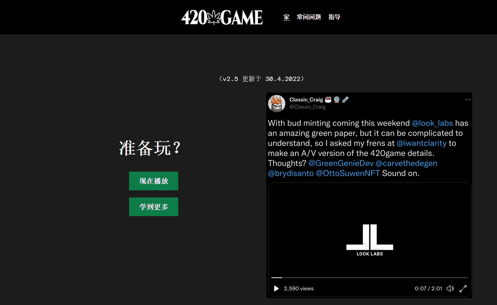

# Look Labs 420 Buds

截至 2022 年 5 月 6 日，已持有 93.54%。

Gen0 Buds 用于在 420.game 中进行繁殖和质押。Gen0 Buds 的初始供应量为 20,000 个。

这些芽可以质押在 420.game 中，以产生游戏内实用代币“$HIGH”。代币的效用纯粹在 420.game 生态系统内。

Look Labs 没有也不会向 $HIGH 提供市场流动性。

420.game 是一款 P2E 杂草游戏，由游戏内代币 $HIGH 及其创新经济驱动。

第一季的主要目标是生产具有最高可能 THC 百分比的 Gen1 菌株，进行质押，并积累 $HIGH。

游戏首先质押 GEN0 芽并产生足够的 $HIGH，以便开始繁殖。

