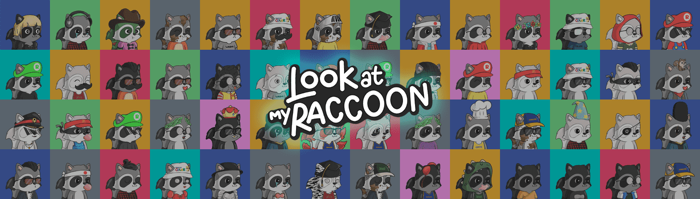

# Look At My Raccoon

看看我的 Raccoon 是用 python 随机生成的 10.000 个项目的集合，并作为 ERC721 令牌存储在以太坊区块链上。 每只浣熊都是独一无二的，由 140 多种可能的特征生成，包括帽子、眼睛、耳朵、嘴巴、衣服和毛皮。

看看我的 Raccoon NFT - 常见问题（FAQ）
▶ 看看我的浣熊是什么？
看看我的浣熊是一个 NFT（不可替代令牌）集合。存储在区块链上的数字艺术品集合。
▶ 看看我的浣熊代币有多少？
总共有 4,460 份 Look At My Raccoon NFT。目前，666 位车主的钱包中至少有一个 Look At My Raccoon NTF。
▶ 看我的浣熊最贵的是什么？
最昂贵的 Look At My Raccoon NFT 是 LookAtMyRaccoon #9799。它于 2022-06-04（3 个月前）以 11.5 美元的价格售出。
▶ 最近卖出了多少只看我的浣熊？
过去 30 天内售出了 2 个 Look At My Raccoon NFT。
▶ 什么是流行的看看我的浣熊替代品？
许多拥有 Look At My Raccoon NFT 的用户还拥有 DegenOkayBears、 WaterBe4nZuki、 Old Legacy和 EL NUMEROS。

