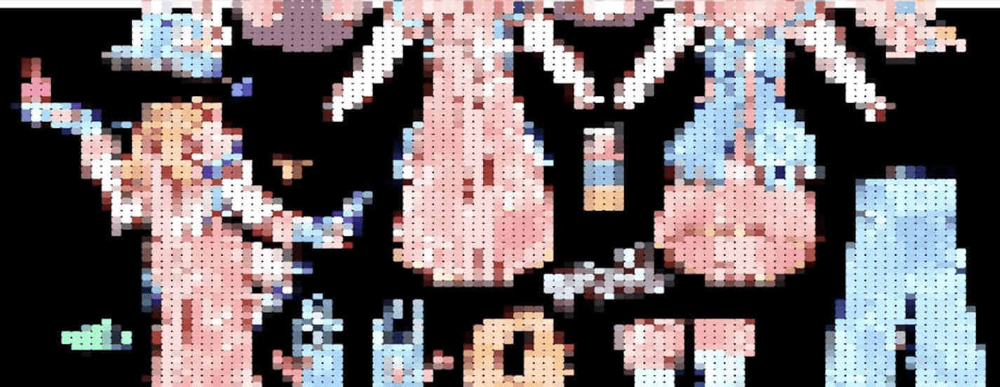

# Look Fashion Loot

LOOK 是一个以可组合元节方式进行的链上实验。 战利品项目的衍生产品。

对于那些敢于召唤
建立在 web3 时尚、空间机器、去中心化制造、沉浸式店面和开放世界 IRL 游戏层的可组合块上的自我维持、自我主权经济体的人来说，该协议是您所需要的一切。

选择你自己的状态。

外面很危险，宝藏只等着大胆的人。

LOOK 是链上文本生成可组合 web3 元节方式的实验。它是 Loot Project 的衍生产品。你可以随心所欲地做你想做的事！这里有一些很酷的衍生产品现在正在发生：

Get Dressed — 由全球设计师网络量身定制的元宇宙就绪服装。
DRIP — 将您的外观变成可以代表 IRL 的实体时尚。
Web3 Fashion Hackathon - 编程可穿戴外观源代码。一个开源时尚内核。
FGO 开源空投——DXM 打印 1155 个 NFT 用于可组合的时尚价格发现。
衍生品竞争——创造令人敬畏的时尚衍生品并获得 LOOK。
Web3 Renaissance Masquerade — Web3 Renaissance Masquerade 的金票。
迈阿密巴塞尔艺术展 IRL — 即将推出。在我们的博客上保持最新状态。

