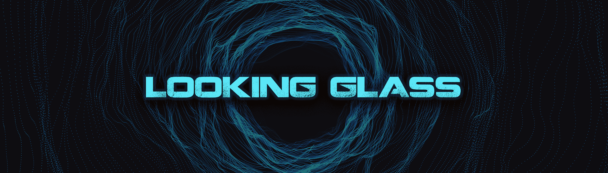

# Looking Glass by ATSNFT

ATSNFT 的 Look Glass 是一组纳米香蕉，将空投给所有在 2022 年 4 月 30 日之前购买的 Apes Together Strong 持有者。 使用并进入窥镜，风险自负。 以后要遵循的说明。

我们的社区
APES TOGETHER STRONG 团队专注于创建一个有机的、有凝聚力的社区，并让该社区中的个人能够就项目的发展发表自己的意见。我们将共同为该项目设定方向，我们的集体创造力、兴奋和决心将为该系列提供真正的价值。

 我们将建立一个安全的多重签名社区钱包，该钱包将从该收藏中获得 25% 的铸币收益，我们将与社区合作，通过允许社区对我们未来的方向进行投票来确定如何实施. 我们已经为项目的开始和第二阶段制定了计划，并且我们已经在艺术创作中听取了社区的意见。

 但我们想听听您的意见！

 该项目未来的分支可能性是无穷无尽的。我们鼓励我们的成员伸出援手，参与我们项目的发展和方向。

 ATS 团队的使命是通过创造一个协作和热情的环境，成长为一个相互支持和相互学习的多元化和包容性社区。如果您是加密货币或 NFT 文化的资深人士，或者只是想探索这个领域的可能性，那也没什么区别。Apes Together Strong 成员将共同努力，创造一个协作、深思熟虑和引人入胜的领域，让我们所有人都能茁壮成长。

