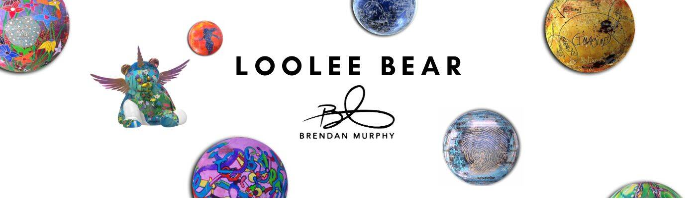

# Loolee Bear

Loolee Bear NFT 在过去 7 天内售出 16 次。Loolee Bear 的总销售额为 1.71 万美元。一只 Loolee Bear NFT 的平均价格为 106.9 美元。有 1,938 名 Loolee Bear 所有者，总共拥有 2,647 个代币。

Boonji：[https ://opensea.io/collection/boonjiproject](https://opensea.io/collection/boonjiproject)

Loolee Bear，由 Brendan Murphy 和 Jupiter Group 带给您

Loolee Bear NFT - 常见问题（FAQ）
▶ 什么是卢利熊？
Loolee Bear 是一个 NFT（Non-fungible token）集合。存储在区块链上的数字艺术品集合。
▶ 有多少个 Loolee Bear 代币？
总共有 2,647 个 Loolee Bear NFT。目前，1,938 位车主的钱包中至少有一个 Loolee Bear NTF。
▶ Loolee Bear 最贵的促销是什么？
最昂贵的 Loolee Bear NFT 是 Loolee Bear #609。它于 2022-06-17（2 个月前）以 274.4 美元的价格售出。
▶ 最近卖了多少卢利熊？
过去 30 天内售出了 87 个 Loolee Bear NFT。
▶ 一只卢利熊要多少钱？
在过去 30 天里，最便宜的 Loolee Bear NFT 销售额低于 53 美元，最高销售额超过 135 美元。过去 30 天，Loolee Bear NFT 的中位价格为 74 美元。
▶ 什么是流行的 Loolee Bear 替代品？
许多拥有 Loolee Bear NFT 的用户还拥有 Boonji Project、 NOOBS NFT、 Crypto Calaveras Genesis Membership和 ELVEN。

