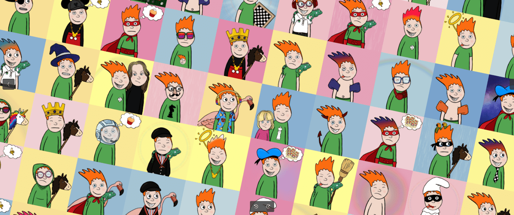

# Looney Luca

网站 | 了解卢卡 | 创作过程 | Price LevelsLooney Luca 是区块链上最酷的男孩。 通过浏览该系列来了解 Luca。 Looney Luca 是一个独特的 NFT 项目，讲述了 Luca 的故事。 它是由一个富有创造力和神经发散性的 NFT 5 口之家创建的。所有卡通、背景和特征都是手绘的，然后自动生成为独特的插图。 销售日期从 2022 年 6 月 2 日开始。定期投放新的 NFT，直到达到 10,000 幅插图的目标。

Looney Luca NFT - 常见问题（FAQ）
▶ 什么是鲁尼卢卡？
Looney Luca 是一个 NFT（非同质代币）集合。存储在区块链上的数字艺术品集合。
▶ Looney Luca 代币有多少？
总共有 1,398 个 Looney Luca NFT。目前，65 位车主的钱包中至少有一个 Looney Luca NTF。
▶ 最昂贵的鲁尼卢卡拍卖会是什么？
售出的最昂贵的 Looney Luca NFT 是 Looney Luca #22。它于 2022 年 8 月 22 日（7 天前）以 4.9 美元的价格售出。
▶ 最近卖了多少鲁尼卢卡？
过去 30 天内售出了 4 个 Looney Luca NFT。
▶ 什么是流行的鲁尼卢卡替代品？
许多拥有 Looney Luca NFT 的用户还拥有 EtherBat 交易卡、 kidykats、 Classy Teens（Autism Acceptance Collection）和 Abstract Home。

