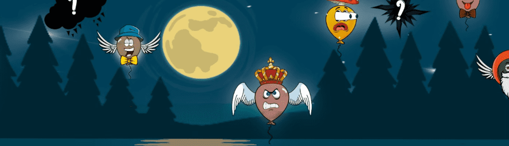

# Loonies.wtf

125ETH NFT 赠品（非稀有性）见 discord 👇🏽▪️ https://discord.gg/thef8club 准备好流行了吗？ 但是等等……这 10.000 只独特的手绘疯狗想要继续他们的太空之旅。 你会帮助他们实现他们到达月球和更远的地方的愿望吗？等一下……它……看起来……好像……他们……是……不是…… ......aloooooneeeee

Loonies.wtf NFT 在过去 7 天内售出 395 次。Loonies.wtf 的总销售额为 8.88 万美元。Loonies.wtf NFT 的平均价格为 22.5 美元。Loonies.wtf 拥有 2,873 名所有者，拥有 10,000 个代币的总供应量。

Loonies.wtf NFT - 常见问题（FAQ）
▶ 什么是 Loonies.wtf？
Loonies.wtf 是一个 NFT（不可替代代币）集合。存储在区块链上的数字艺术品集合。
▶ 有多少 Loonies.wtf 代币？
总共有 10,000 个 Loonies.wtf NFT。目前，2,873 位所有者的钱包中至少有一个 Loonies.wtf NTF。
▶ Loonies.wtf 最贵的交易是什么？
最昂贵的 Loonies.wtf NFT 是 Loonies #6358。它于 2022 年 6 月 27 日（2 个月前）以 494 美元的价格售出。
▶ 最近卖出了多少 Loonies.wtf？
过去 30 天共售出 1,767 个 Loonies.wtf NFT。
▶ Loonies.wtf 需要多少钱？
在过去 30 天里，Loonies.wtf NFT 最便宜的销售额低于 4 美元，最高销售额超过 16 美元。Loonies.wtf NFT 在过去 30 天内的中位价格为 8 美元。
▶ 什么是流行的 Loonies.wtf 替代品？
许多拥有 Loonies.wtf NFT 的用户还拥有 The F8 Club、 Photosynthesis Official、 Flooz GEN F和 The F8 Club-Red Edition。

