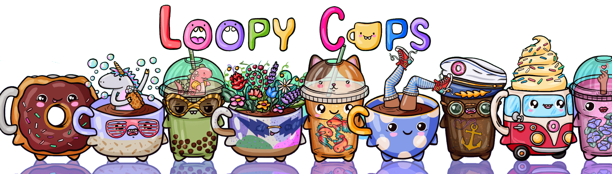

# LoopyCups

Loopy Cups 是 Loopy Donuts 的忠实伙伴。 每个 Loopy Cup 都是一件独特的艺术品，由 200 多种手绘特征组成。 数以千计的组合是可能的，但区块链上只允许存在 20,000 个。有关 Loopy Cups 和 Loopy Donuts 的更多信息，请访问 Loopyland.club

10,000 个 Loopy Donuts 设法逃离了无聊、陈旧的甜甜圈店的货架，在以太坊区块链周围嬉戏。虽然看起来我们的 Loopy Donuts 很有趣，但它们实际上是为了让您的一天更加甜蜜。

你好！我是 Xenia，全职艺术家和玩具创作者。很高兴有机会向您介绍我的艺术。

我拥有一个设计工作室，我们为成年人设计和制造玩具，他们不想长大，总是看着生活中可爱的一面：）

我非常热衷于创造新世界，这是我的第一个 NFT 项目。该项目从收集由 100 个特征创建的 10,000 个甜甜圈开始，我手工说明并通过算法随机选择。

希望我能认识我所有的 Loopy Donuts 所有者，并乐于分享我的经验。

