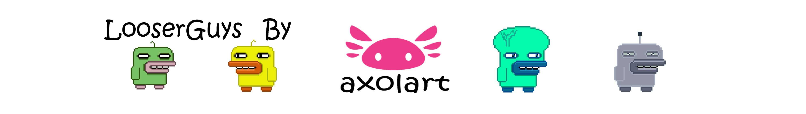

# LooserGuys Minter

立即获取 LooserGuy 铸币机来铸造一个或多个 LooserGuy！购买 LooserGuy 只需通过铸币机购买！ 您可以通过宽松的方式购买许多宽松的人，他在一个中有 10 000 件物品🎁 您可以在此处查看已经铸造的 LooserGuy：LooserGuy❓ LooserGuy 是一组 10.000 个随机生成的收藏品。所有的 LooserGuy 将以 0.03 ETH 和 2% 的费用 对于所有所有者二手销售！有关更多信息，请访问我们的网站。邮件：axolart.nft@gmail.com

LooserGuys 是 10,000 个独特生成的角色 以 0.03 eth 的固定价格和 2% 的二次销售费用出售**。没有两个是完全一样的，每个都可以在以太坊区块链上由一个人正式拥有。它们是通过算法生成的 64x64 像素艺术图像。大多数是 Commun，但也混入了一些稀有类型：Zombie、Robot、Skeleton、Rainbow、Alien 和一种独特而神秘的魔鬼，他是独一无二的，只有一种可用。对于超过 100 万的组合，松散的人可以拥有 142 种资产。

