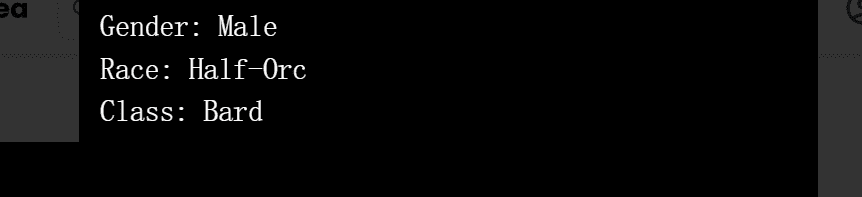

# Loot Class

战利品等级是战利品衍生品。 它们是随机生成并存储在链上的 RPG 风格类。 随意以任何你想要的方式使用它。

过去 7 天没有售出任何战利品实验室。

lootlabs NFT - 常见问题（FAQ）
▶ 什么是战利品实验室？
lootlabs 是一个 NFT（不可替代令牌）集合。存储在区块链上的数字艺术品集合。
▶ 有多少个lootlabs 代币？
总共有 1 个 lootlabs NFT。目前 1 位所有者的钱包中至少有一个 lootlabs NTF。
▶ 最近售出了多少个战利品实验室？
过去 30 天内售出 0 个 lootlabs NFT。

