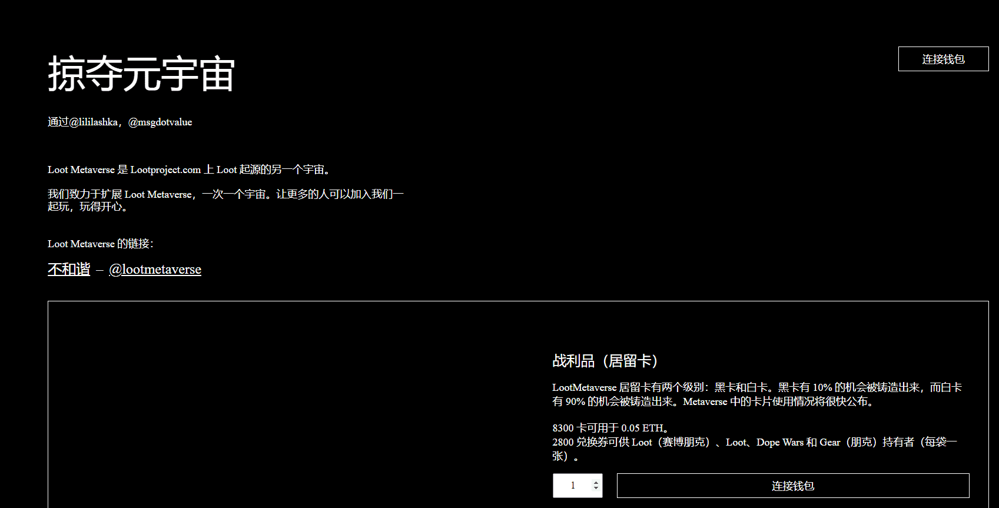

# Loot (for Cyberpunks)

欢迎来到 LootMetaverse 的替代宇宙 #1。拿起一个包，准备在赛博朋克异托邦度过一个无尽的夜晚。

袋子 1-8000 保留给战利品持有者。包 8001-10000 可供所有人使用。物品将由您的合成战利品的特性决定。

Loot Metaverse 是 Lootproject.com 上 Loot 起源的另一个宇宙。

我们致力于扩展 Loot Metaverse，一次一个宇宙。让更多的人可以加入我们一起玩，玩得开心。

LootMetaverse 居留卡有两个级别：黑卡和白卡。黑卡有 10% 的机会被铸造出来，而白卡有 90% 的机会被铸造出来。Metaverse 中的卡片使用情况将很快公布。

8300 卡可用于 0.05 ETH。
2800 兑换券可供 Loot（赛博朋克）、Loot、Dope Wars 和 Gear（朋克）持有者（每袋一张）。

