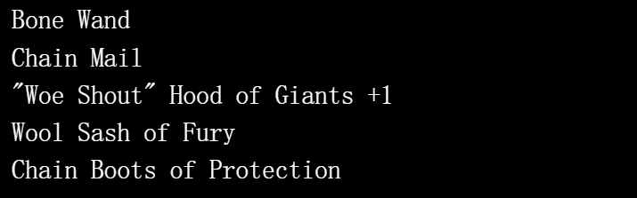

# Loot on Polygon (PolyLoot)

PolyLoot 是一组 8000 件在 Polygon(Matic) 上的战利品，一种随机生成并存储在链上的冒险家装备。 故意省略统计信息、图像和其他功能以供其他人解释。 随意以任何你想要的方式使用 PolyLoot。

抢劫

PolyLoot 是一组 8000 个在多边形（Matic）上的战利品，一个

随机生成和存储的冒险家装备

在链上。统计信息、图像和其他功能是

故意省略让别人解释。

随意以任何你想要的方式使用 PolyLoot。

免费领取 PolyLoot！

如何索赔：

连接元掩码。填写一个数字1-8000，点击Claim

如果 ID 尚未领取，您将被要求在 Metamask 中签署交易

